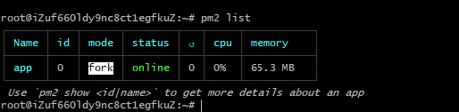
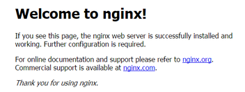

 💃 💃算是个小总结

### 上阿里云买个服务器这个不就用我来说了吧

 小项目的话买个1核1g的linux就行，毕竟也没打算玩什么大家伙，这边买完之后进个人中心会发现我们的服务器已经正在跑了

 

 点击远程连接，会出现一个新的tab，带着一个黑色的控制台，我们可以在这里面进行一些服务器的操作。
 但是每一次都要开网页才能操作服务器怪麻烦，可以直接用本地的bash直连服务器进行相关操作。
 可以直接使用ssh root@ip直接从bash连上服务器，输入密码就行。如果觉得每次输密码也麻烦的话可一步到位：

 `cat ~/.ssh/id_rsa.pub |ssh root@ip 'mkdir -p .ssh && cat >> .ssh/authorized_keys'`
 看到这篇文章的人我默认你已经有了自己的公钥和私钥。🤔🤔

### 上服务器下最新的node包

 `wget https://npm.taobao.org/mirrors/node/v10.16.0/node-v10.16.0-linux-x64.tar.xz`
 是个xz后缀的包，需要解压两次：
 `xz -d node-v10.16.0-linux-x64.tar.xz`
 `tar -xvf node-v10.16.0-linux-x64.tar`

 之后回到根目录建立软链
 `ln -s /node/node-v10.16.0-linux-x64/bin/node /usr/bin/node`
 `ln -s /node/node-v10.16.0-linux-x64/bin/npm /usr/bin/npm`
 弄完之后分别输出一下版本
 `node -v    npm -v`
 期望如下：
 
 💃 node环境搭建ok

### 上传项目
把项目打成一个zip包之后发送到服务器
`scp xxx root@ip:/fileFolder`

开始守护进程
`npm install pm2 -g`
`pm2 start xxx --watch`
同时可以`pm2 list`列一下目前正在守护的进程


还需配置nginx：
1. 新服务器我们先更新一下源，`apt-get update`
2. 安装PCRE库，zlib库，ssl `sudo apt-get install libpcre3 libpcre3-dev libpcrecpp0v5 libssl-dev zlib1g-dev`
3. cd到你想要的目录
4. 选一个nginx版本 `wget http://nginx.org/download/nginx-1.xx.x.tar.gz`
5. 解压 `tar -zxvf nginx-1.13.1.tar.gz`
6. cd进目录， `./configure`
7. `make && make install`
8. 启动ngxin

一般这个时候直接访问服务器ip，看到nginx默认页面就ok

可以`nginx -t`查看一下配置文件的位置， 不过一般都是在`/usr/local/nginx/conf`下面，找到`nginx.conf`，改一下配置就行，具体配置规则百度即可

如果前端是个vue项目的话，`npm run build`之后把dist下的static和index直接丢到服务器上，nginx配置一下入口的转发，默认监听80
```
location / {
  root /vue-cloud/dist;
  try_files $uri $uri /index.html last
  index index.html index.html;
}
```
如果想监听其他的端口另行配置。
