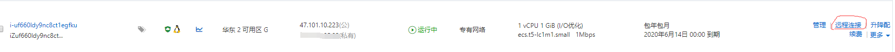
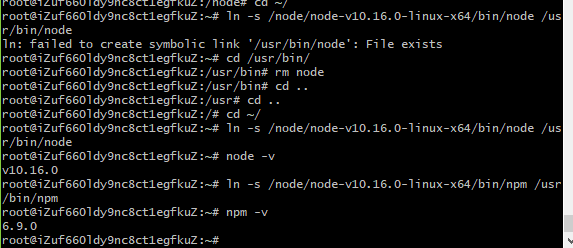

 💃 💃算是个小总结

### 上阿里云买个服务器这个不就用我来说了吧

 小项目的话买个1核1g的linux就行，毕竟也没打算玩什么大家伙，这边买完之后进个人中心会发现我们的服务器已经正在跑了

 

 点击远程连接，会出现一个新的tab，带着一个黑色的控制台，我们可以在这里面进行一些服务器的操作。
 但是每一次都要开网页才能操作服务器怪麻烦，可以直接用本地的bash直连服务器进行相关操作。
 可以直接使用ssh root@ip直接从bash连上服务器，输入密码就行。如果觉得每次输密码也麻烦的话可一步到位：

 `cat ~/.ssh/id_rsa.pub |ssh root@ip 'mkdir -p .ssh && cat >> .ssh/authorized_keys'`
 看到这篇文章的人我默认你已经有了自己的公钥和私钥。🤔🤔

### 上服务器下最新的node包

 `wget https://npm.taobao.org/mirrors/node/v10.16.0/node-v10.16.0-linux-x64.tar.xz`
 是个xz后缀的包，需要解压两次：
 `xz -d node-v8.9.3-linux-x64.tar.xz`
 `tar -xvf node-v8.9.3-linux-x64.tar`

 之后回到根目录建立软链
 `ln -s /node/node-v10.16.0-linux-x64/bin/node /usr/bin/node`
 `ln -s /node/node-v10.16.0-linux-x64/bin/npm /usr/bin/npm`
 弄完之后分别输出一下版本
 `node -v    npm -v`
 期望如下：
 
 💃 node环境搭建ok
